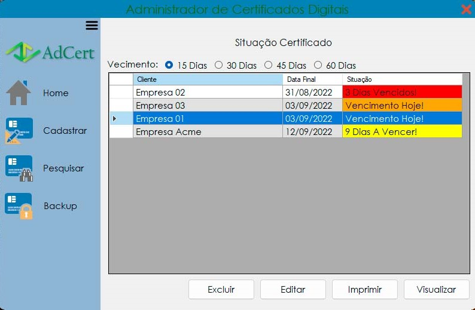
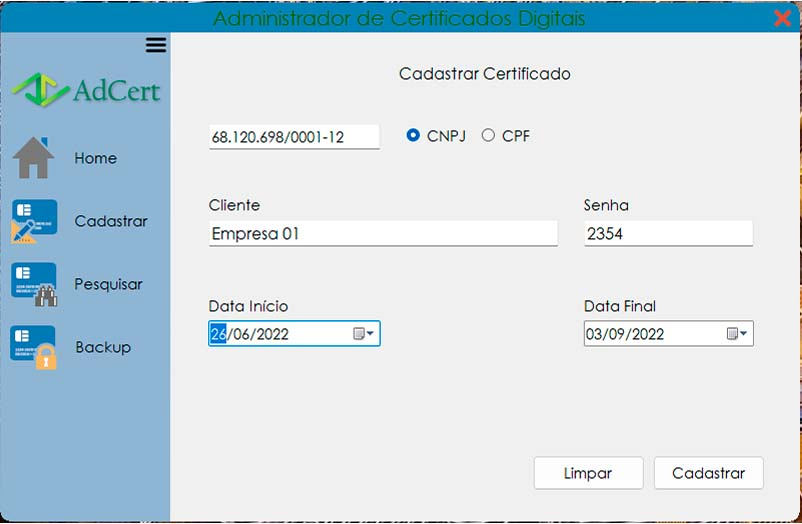

# AdCert
Solução Desenvolvida em C# para registro e manutenção de Certificados Digitais. 
Está é a uma simples versão, a versão 1.0. Mas construída usando as melhores práticas de programação.

Nessa versão, o cadastro é feito de forma manual ainda. Em versões posteriores ela é feita através da leitura dos certificados digitais A1 e A3.
Possui ainda as funções de pesquisa e backup do banco de dados.

Como foi dito, é um simples sistema, mas de muita importância pra empresas que usam vários certificados, como contabilidades e etc.
Pois pode ser iniciado com o windows.

